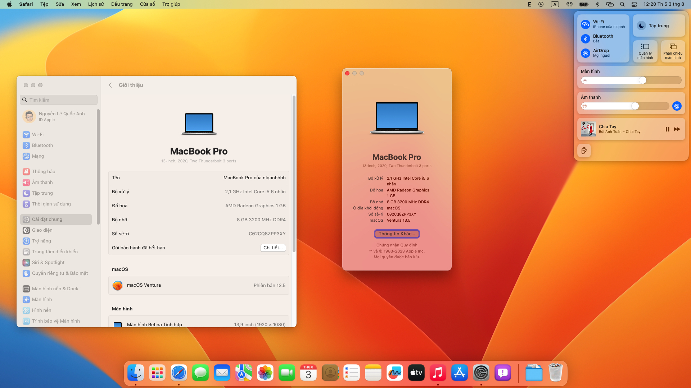
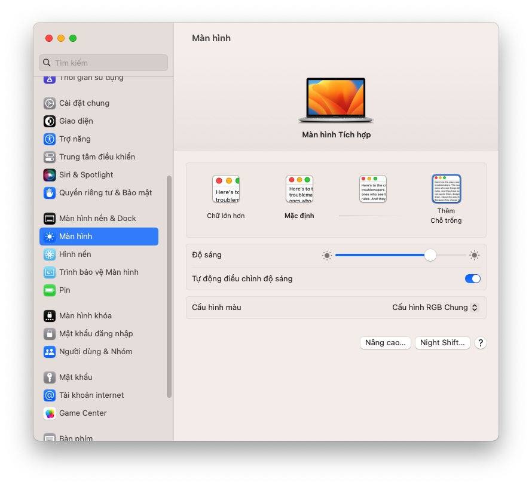

# Hackintosh-Asus-TM420UA
A prebuilt Hackintosh EFI for Asus TM420UA

## Specification
-  **Model:** Asus TM420UA-EC022T
-  **Processor:** AMD Ryzen® 5 5500U 2.1GHz
-  **Graphic:** AMD Radeon® Vega 7
-  **Storage:** Intel® SSDPEKNU512GZ 512GB SSD
-  **Network:** Intel® Wi-Fi 6 AX210
-  **Audio:** Realtek ALC256
-  **Screen:** 13,9" FullHD IPS Touch Screen
-  **Touchpad:** I2C Touchpad
-  **Keyboard:** PS2 Keyboard
-  **Card Reader:** microSD Card Reader
-  **WebCam:** VGA Web Camera
-  **Battery:** Lithium-ion 3 Cell
  
## Working Features
-  Graphics: AMD Radeon Vega 7
-  Sound:
   + Speaker: Working
   + Headphone Jack: Working (with [ComboJack](https://github.com/hackintosh-stuff/ComboJack) installed)
   + Microphone: Working (with [AMD Microphone](https://github.com/qhuyduong/AMDMicrophone) installed)
-  Dual band Wifi
-  Bluetooth 5.0
-  USB Ports
-  Adjust Brightness and Audio (With Fn + F1/F2/F3/F4/F5)
-  Trackpad, Touchscreen
-  Temperature often be between 60ºC and 65ºC
-  HDMI (no audio supported by Nred yet)
-  Card Reader
-  Battery lasts about 2 hours.

## Images

## Note
- To use audio jack properly, you must install [ComboJack](https://github.com/hackintosh-stuff/ComboJack)
- To use microphone, you must install [AMDMỉcrophone kext](https://github.com/qhuyduong/AMDMicrophone)
- You can enable [HiDPI](https://github.com/xzhih/one-key-hidpi) if you want to have Monitor configurations like on a real Mac
  

## Recommendation
- You should use [Smokeless_UMAF](https://github.com/DavidS95/Smokeless_UMAF) to increase VRAM size to 1GB (minimum), by default VRAM is set to 512MB, which will freeze the system when run some apps like Spotify or Discord. Create a boot USB by following the guide in [Smokeless_UMAF](https://github.com/DavidS95/Smokeless_UMAF) then choose Device Manager, AMD CBS, NBIO Common Options, GFX Configuration then set iGPU Configuration to UMA_SPECIFIED, an option named UMA Frame Buffer Size will appear, now you can set your VRAM size, which is 512MB by default

## Known Issue
-  Airdrop and Handoff is not working (Intel Wifi)
-  Sleep is not working  
-  Keyboard backlight is not working
-  macOS may freeze randomly 
  
## Credit
-  [qhuyduong](https://github.com/qhuyduong) for [AMD Microphone](https://github.com/qhuyduong/AMDMicrophone)
-  [NootInc](https://github.com/NootInc) for [NootedRed](https://github.com/NootInc/NootedRed)
-  [Apple](https://www.apple.com) for [macOS](https://www.apple.com/macos)
-  [VNO Hackintosh on Facebook](https://www.facebook.com/groups/vnohackintosh/?epa=SEARCH_BOX)
-  [Dortania Guide](https://dortania.github.io/OpenCore-Install-Guide/)
-  [Website vnohackintosh.com](https://vnohackintosh.com)
  
