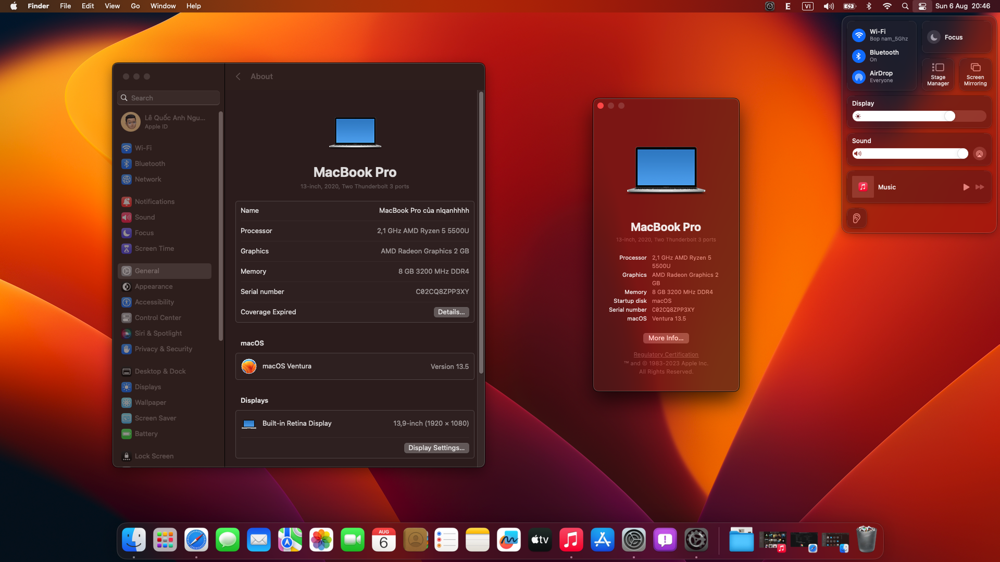

# Hackintosh-Asus-TM420UA
<h2 align="center">A prebuilt Hackintosh EFI for Asus TM420UA</h2>

  

## Specification
-  **Model:** Asus TM420UA-EC022T
-  **Processor:** AMD Ryzen® 5 5500U 2.1GHz
-  **Graphic:** AMD Radeon® Vega 7
-  **Storage:** Intel® SSDPEKNU512GZ 512GB SSD
-  **Network:** Intel® Wi-Fi 6 AX200
-  **Audio:** Realtek ALC256
-  **Screen:** 13,9" FullHD IPS Touch Screen
-  **Touchpad:** I2C Touchpad
-  **Keyboard:** PS2 Keyboard
-  **Card Reader:** microSD Card Reader
-  **WebCam:** VGA Web Camera
-  **Battery:** Lithium-ion 3 Cell
  
## Working Features
-  Graphics: AMD Radeon Vega 7
-  Sound:
   + Speaker: Working
   + Headphone Jack: Working (with [ComboJack](https://github.com/hackintosh-stuff/ComboJack) installed)
   + Microphone: Working (with [AMD Microphone](https://github.com/qhuyduong/AMDMicrophone) installed)
-  Dual band Wifi
-  Bluetooth 5.0
-  USB Ports
-  Adjust Brightness and Audio (With Fn + F1/F2/F3/F4/F5)
-  Trackpad, Touchscreen
-  Temperature often be between 60ºC and 65ºC
-  HDMI (with audio support)
-  Card Reader
-  Battery lasts about 2 hours.

## Note
- Currently, Nootedred only support from macOS Catalina to macOS Sonoma, so you can't install macOS 10.14 and below
- To use Wifi and Bluetooth, you must install [AirportItlwm.kext](https://github.com/OpenIntelWireless/itlwm) for Wifi and for Bluetooth, you need [IntelBluetoothFirmware](https://github.com/OpenIntelWireless/IntelBluetoothFirmware), [IntelBTPatcher](https://github.com/OpenIntelWireless/IntelBluetoothFirmware), and [IntelBluetoothInjector](https://github.com/OpenIntelWireless/IntelBluetoothFirmware) (for Big Sur and older) or [BlueToolFixup](https://github.com/acidanthera/BrcmPatchRAM) (for Monterey and newer)
  
- On macOS 13.4 and above, Bluetooth can't be turn on and off normally. So we need to patch it.  
  Open your **config.plist**, go to **NVRAM** > **Add** > **7C436110-AB2A-4BBB-A880-FE41995C9F82** and add two child items:  
  Key: **bluetoothInternalControllerInfo** - Type: **Data** - Value: **0000000000000000000000000000**  
  Key: **bluetoothExternalDongleFailed** - Type: **Data** - Value: **00**  
  
- To use audio jack properly, you must install [ComboJack](https://github.com/hackintosh-stuff/ComboJack)
- To use microphone, you must install [AMDMỉcrophone.kext](https://github.com/qhuyduong/AMDMicrophone)
  
- You should use [Smokeless_UMAF](https://github.com/DavidS95/Smokeless_UMAF) to increase VRAM size to 1GB (minimum), by default VRAM is set to 512MB, which will freeze the system when run some apps like Spotify or Discord. Create a boot USB by following the guide in [Smokeless_UMAF](https://github.com/DavidS95/Smokeless_UMAF) then choose Device Manager, AMD CBS, NBIO Common Options, GFX Configuration then set iGPU Configuration to UMA_SPECIFIED, an option named UMA Frame Buffer Size will appear, now you can set your VRAM size, which is 512MB by default
     
- You can enable [HiDPI](https://github.com/xzhih/one-key-hidpi) if you want to have Monitor configurations like on a real Mac
  

## Known Issue
-  Airdrop and Handoff is not working (Wanna fix? Buy BCM94360NG)
-  Sleep is not working
-  Keyboard backlight is not working
-  Hardware acceleration has not worked yet
-  macOS may freeze randomly (increasing VRAM would fix most of this)

## Images

## Credit
-  [qhuyduong](https://github.com/qhuyduong) for [AMD Microphone](https://github.com/qhuyduong/AMDMicrophone)
-  [NootInc](https://github.com/NootInc) for [NootedRed](https://github.com/NootInc/NootedRed)
-  [Apple](https://www.apple.com) for [macOS](https://www.apple.com/macos)
-  [VNO Hackintosh on Facebook](https://www.facebook.com/groups/vnohackintosh/?epa=SEARCH_BOX)
-  [Dortania Guide](https://dortania.github.io/OpenCore-Install-Guide/)
-  [Website vnohackintosh.com](https://vnohackintosh.com)
  
